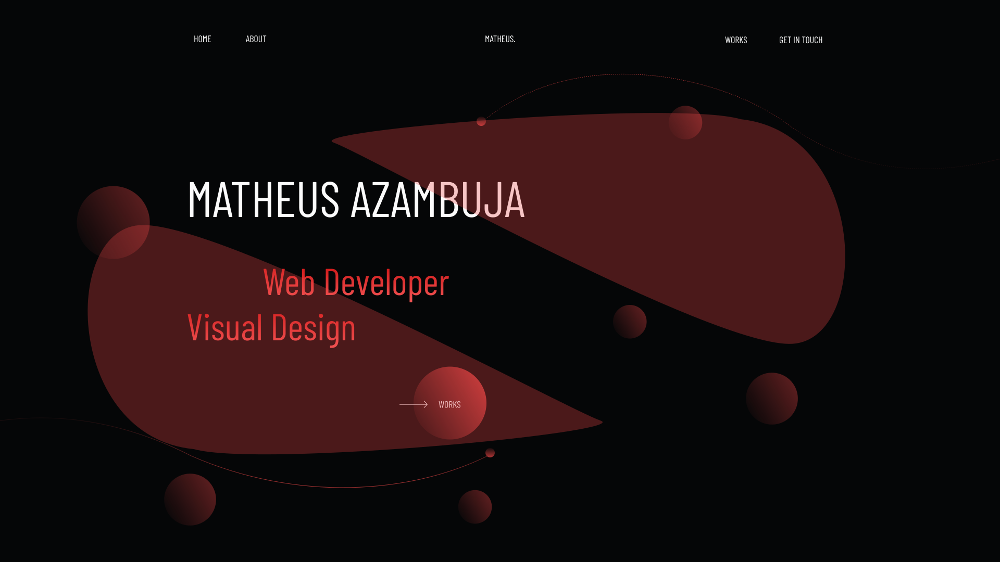

# Personal portfolio

<h1 align="center">
    
</h1>

[Site live](https://hamishw.com)

My personal portfolio to showcase my main projects

 

## 🧪 Technologies

This project was developed using the following technologies:

- [HTML](https://developer.mozilla.org/pt-BR/docs/Web/HTML)
- [SASS](https://sass-lang.com/)
- [GSAP](https://greensock.com/gsap/)

## 📝 License

This project is licensed under the MIT License. See the [LICENSE](LICENSE.md) file for details.

---

Made with 💜 by Matheus Azambuja
